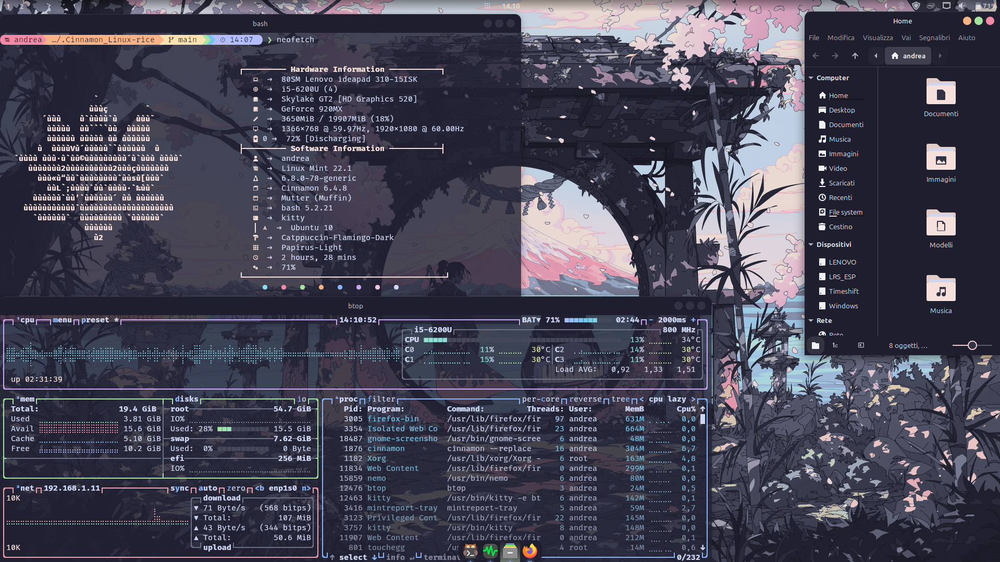

# My Catppuccin Rice for Linux Mint Cinnamon


This repository contains all my configuration files ("dotfiles") to customize a fresh Linux Mint Cinnamon installation with the Catppuccin theme.

## Migration Guide

### Step 1: Initial Setup

On a fresh Linux Mint system, open a terminal and run these commands to install the basic tools and clone this repository.

```bash
sudo apt update
sudo apt install git curl wget -y
git clone https://github.com/andreagallo-dev/Cinnamon_Linux-rice.git
cd Cinnamon_Linux-rice
```

### Step 2: Software Packages Installation

This command will read the `packages.list` file and automatically install all the necessary programs (themes, terminal, icons, tools, etc.). This operation will take a few minutes.

```bash
sudo xargs -a packages.list apt install -y
```

### Step 3: Restoring Personal Configurations

This script will copy all the themes, icons, and configuration files from this repository into the correct folders on your new system.

**Run this entire block of commands:**

```bash
# Create necessary directories (ignore errors if they already exist)
mkdir -p ~/.config ~/.themes ~/.icons ~/.local/share/applications ~/.local/share/plank/themes

# Copy program configurations (kitty, neofetch, btop, etc.)
cp -r config/* ~/.config/

# Copy GTK themes (all variants)
cp -r themes/* ~/.themes/

# Copy icon and cursor themes (all variants)
cp -r icons/* ~/.icons/

# Copy Plank themes
cp -r local/share/plank/* ~/.local/share/plank/themes/

# Copy custom application launchers (e.g., btop)
cp local/share/applications/*.desktop ~/.local/share/applications/

# Copy the terminal configuration (.bashrc)
cp .bashrc ~/

# Copy the tool for coloring Papirus folders
cp -r papirus-folders/ ~/.papirus-folders

# Reload the terminal configuration to activate Starship
source ~/.bashrc

echo "Configurations restored successfully!"
```

## Step 4:  Spicetify Setup (Themed Spotify)

### 1. Install Spicetify
# First, run the official installation script. Answer 'Y' (yes) when asked to install the Marketplace.

 curl -fsSL https://raw.githubusercontent.com/spicetify/spicetify-cli/master/install.sh | sh


### 2. Restore Spicetify Configuration
# This command copies all your themes, extensions, and settings from this repository
# to the correct system location.
# IMPORTANT: Run this command from inside the cloned dotfiles repository folder.

 cp -r config/spicetify ~/.config/


### 3. Apply the Theme to Spotify
# This is the full, safe procedure to patch the Spotify client while handling file permissions correctly.
# You MUST run this entire 4-step process again every time the Spotify client updates itself.


# 1: Temporarily take ownership of the folder.
# IMPORTANT: Replace 'your_username' with your actual username on the new machine!

 sudo chown -R your_username:your_username /usr/share/spotify


# 2: Apply the changes as your normal user.
# NOTE: The very first time you run this on a new machine, use "spicetify backup apply".
# For all subsequent updates, "spicetify apply" is sufficient.

 spicetify apply


# 3: Return ownership to root for security.

 sudo chown -R root:root /usr/share/spotify


# 4: Add read permissions for all users (this prevents the black screen issue).

 sudo chmod -R a+rX /usr/share/spotify


### Step 5: Final Steps (requiring `sudo` or user interaction)

These last steps must be done manually.

1.  **Apply Colors to Papirus Folders:**
    This command uses the tool we just copied to apply Catppuccin colors to the system-wide Papirus icon theme.

    ```bash
    sudo cp -r ~/.papirus-folders/src/* /usr/share/icons/Papirus/
    papirus-folders -C cat-mocha-rosewater --theme Papirus-Dark
    ```
    *(Remember to change cat-mocha-rosewater if you chose a different color!)*

2.  **Install Nerd Fonts:**
    To display icons correctly in the terminal, you need to install a Nerd Font. The recommended choice is FiraCode Nerd Font.

    - Download it from the official site: https://www.nerdfonts.com/font-downloads
    - Unzip the file and copy the .ttf files to ~/.local/share/fonts.
    - Run fc-cache -fv in the terminal to refresh the font cache.

3.  **Activate Themes in Cinnamon:**
    - Go to `Menu > System Settings > Themes` .
    - Manually select the newly installed themes:
      - **Windows:** `Catppuccin-Mocha-...`
      - **Icons:** `Papirus-Dark`
      - **Controls:** `Catppuccin-Mocha-...`
      - **Mouse pointer:** `Catppuccin-Mocha-Dark`
      - **Desktop:** `Catppuccin-Mocha-...`

4.  **Reboot Computer:**
    A final reboot ensures that all services (like Plank) start correctly and all settings are loaded.

Done! Your new system is now a perfect clone of the previous one.
